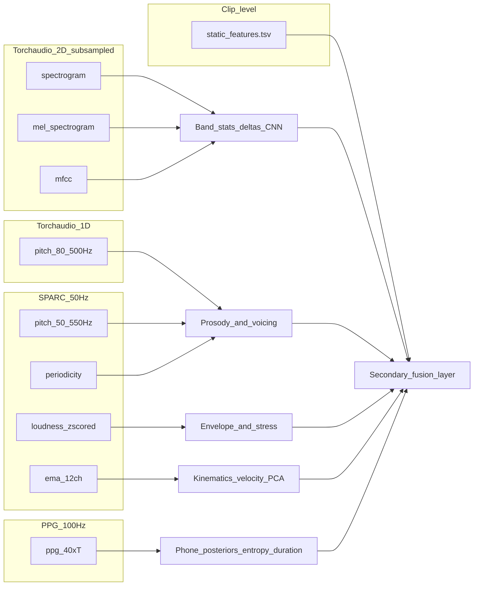

# Features folder: modalities, experiments, derivations, and library parameters

Exported from the Cursor plan `features_breakdown_and_derivations_dd6637b2`. Paths below are relative to the dataset repository root (the folder containing `features/` and `phenotype/`).

---

Data layout common to almost all feature stores: **primary key** `[participant_id, session_id, task_name]` plus **`n_frames`** and one or more **Parquet** columns (nested lists, **zstd** compression). Companion JSONs in [features/](features/) are the authoritative **schema + extraction config** (your workspace may or may not include the `.parquet` binaries).

---

## 1. File-by-file breakdown (from each JSON)

### [features/static_features.json](features/static_features.json) + [features/static_features.tsv](features/static_features.tsv)

- **What it is:** One **wide row per clip** (tabular), not a time series tensor in Parquet.
- **Content groups (from field descriptions):**
  - **IDs / text:** `participant_id`, `session_id`, `task_name`, `transcription` (when present).
  - **openSMILE-style low-level descriptors (GeMAPS-like naming, `sma3` / `sma3nz`):** F0 semitone features, loudness, spectral flux, MFCCs 1–4, jitter/shimmer, HNR, harmonic ratios, F1–F3 frequency/bandwidth/relative amplitude, voiced vs unvoiced spectral summaries (alpha ratio, Hammarberg, slopes, flux, MFCCs), segment timing stats (voiced/unvoiced counts and lengths, loudness peaks/sec), equivalent level.
  - **Higher-level / extended scalars:** speaking and articulation rates, phonation ratio, pause metrics, Praat-like / custom **F0 and intensity** stats, **HNR**, **spectral slope/tilt**, **CPP**, formant tracks summaries, **spectral moments** (gravity, std, skewness, kurtosis), full **jitter/shimmer family** (local, RAP, PPQ5, DDP, APQ variants, DDA), **STOI**, **PESQ**, **SI-SDR**.
- **JSON gap:** No explicit **software version / config block** (unlike Torchaudio/SPARC/PPG JSONs). For a library, treat provenance as **external** (document assumed pipeline, e.g. openSMILE config name, Praat script version) or recover from dataset documentation outside this folder.

### [features/torchaudio_spectrogram.json](features/torchaudio_spectrogram.json)

- **Tensor:** `spectrograms` — **log-magnitude spectrogram**, **float32**, shape **`[201, T]`**, dims **frequency × time**, units **dB**.
- **STFT config:** `n_fft` 400, `win_length` 400, `hop_length` 160 (at **16 kHz** implied by hop duration notes).
- **Post-processing (privacy):** **`data[:, ::2]`** — half the **time** frames kept → effective hop **320 samples**, frame rate halved (**~50 Hz** native STFT frames → **~25 Hz** after subsample; align math when implementing).
- **Provenance:** `torchaudio.transforms.Spectrogram`, Torchaudio **2.8.0**.

### [features/torchaudio_mel_spectrogram.json](features/torchaudio_mel_spectrogram.json)

- **Tensor:** `mel_spectrogram`, shape **`[60, T]`**, **mel_bin × time**.
- **Config:** `sample_rate` **16000**, same STFT window/hop as above, **`n_mels` 60**.
- **Post-processing:** Same **`::2`** time subsampling as linear spectrogram.
- **Provenance:** `torchaudio.transforms.MelSpectrogram`, **2.8.0**.

### [features/torchaudio_mfcc.json](features/torchaudio_mfcc.json)

- **Tensor:** `mfcc`, shape **`[60, T]`**, **coefficient × time**; **`n_mfcc` 60** with `melkwargs` matching the mel front-end (n_fft 400, win_length 400, hop_length 160, n_mels 60).
- **Post-processing:** Same **`::2`** subsampling.
- **Provenance:** `torchaudio.transforms.MFCC`, **2.8.0**.

### [features/torchaudio_pitch.json](features/torchaudio_pitch.json)

- **Tensor:** `pitch`, **1D** `[T]`, units **Hz**.
- **Config:** `sample_rate` **16000**, **`freq_low` 80**, **`freq_high` 500** (narrower band than SPARC CREPE).
- **Serialization:** `list<float>` (no nested 2D).
- **Notable:** JSON documents **no** `::2` time subsampling (unlike spectrogram/mel/mfcc). Any joint modeling with those tensors must **resample or interpolate** to a common time grid.

### [features/ppgs.json](features/ppgs.json)

- **Tensor:** `ppg`, shape **`[40, T]`**, **phoneme × time**, values **probability** in **[0, 1]**, row-normalized per frame.
- **Phoneme axis:** **40** ARPAbet-style labels ending in **`silence`** (full list in JSON).
- **Time axis:** **`sampling_rate_hz`: 100** (PPG frame rate).
- **Provenance:** `ppgs` package **0.0.9**, `ppgs.from_audio(audio, sample_rate=16000)`; paper reference in JSON (Churchwell, Morrison, Pardo, ICASSP workshop 2024 / arXiv).

### SPARC (`speech-articulatory-coding` **0.1.0**, `model_name`: **`multi`**, command pattern `load_model(...); encode(waveform)`)

All SPARC 1D streams share **`sampling_rate_hz`: 50** and align in time with each other.

| File | Series | Shape / notes |
|------|--------|----------------|
| [features/sparc_pitch.json](features/sparc_pitch.json) | `pitch` | 1D Hz, value_range **[50, 550]**; CREPE-derived; internal **fmin/fmax**, **pitch_hop_length** 160, **pitch_q** 2, **crepe_model** `full` |
| [features/sparc_periodicity.json](features/sparc_periodicity.json) | `periodicity` | 1D **[0, 1]** voicing confidence |
| [features/sparc_loudness.json](features/sparc_loudness.json) | `loudness` | 1D; **z-scored** waveform **amplitude** per **20 ms** windows at 16 kHz (see units/notes) |
| [features/sparc_ema.json](features/sparc_ema.json) | `ema` | **2D `[T, 12]`** — dims documented as **`[time, articulator_channel]`** with 12 channels: **TD/TB/TT/LI/UL/LL** each **X/Y** |

---

## 2. What you can experiment with (by modality)

- **Static row:** Multimodal prediction from tabular only (phenotype + static acoustics), **interpretability** (known semantics per column), **correlation structure** across openSMILE blocks vs extended scalars; risk of **redundancy** and unknown exact openSMILE config from JSON alone.
- **Linear / mel / MFCC (Torchaudio):** **ASR front ends**, **CNNs/Transformers** on 2D time-frequency, **augmentation studies** (must respect already-applied **`::2`**), **inverse consistency** checks (mel vs MFCC vs linear), **band-limited** analyses using bin indices.
- **Torchaudio pitch:** Cheap **prosody** baseline vs SPARC pitch; compare **80–500 Hz** band to SPARC **50–550 Hz** and different algorithms.
- **PPG:** **Phonetic content**, **uncertainty** over time, **alignment** to words if you add transcripts, **dysfluency** or **reduced contrast** between phoneme classes in clinical groups.
- **SPARC pitch + periodicity:** **Robust F0** / voicing for kids’ voices, **phonation segmentation**, **F0 statistics** computed on masked frames.
- **SPARC loudness:** **Energy envelopes**, stress, **after undoing z-score** only if you store utterance-level scale elsewhere (currently relative within clip).
- **SPARC EMA:** **Articulatory gesture** timing, **lip/jaw vs tongue** coordination, **trajectory complexity** (path length, velocity), **low-dimensional manifolds** across tasks.

---

## 3. Secondary features derivable from each primary source

Use arrows as “from → plausible derived signals / models.”

- **Static row →** interaction ratios (e.g. HNR / jitter), composite **breathiness / strain** proxies, z-scores within task or age bin, **missingness flags**, outlier detection; **do not** re-derive low-level stats that already duplicate time-domain work unless for **consistency checks**.
- **Spectrogram / mel / MFCC →** summary stats per band (entropy, modulation spectrum), **delta / delta-delta** (on log mel or MFCC), **VQ-VAE / HuBERT** latent, **onset strength**, **reconstruction error** if you train an autoencoder, **temporal context** windows (with explicit **hop = 320 samples** after `::2`).
- **Torchaudio pitch →** voicing from thresholds, **F0 derivative**, **tilt**, subharmonics ratio (careful at bounds), **jitter-like** stats from period sequence (only where voiced).
- **PPG →** **argmax phoneme** trajectory, **entropy per frame**, **bigram transition rates**, **Viterbi-smoothed** path, **phone duration** posteriors, **gop-like** divergence from canonical sequence (if you have expected text).
- **SPARC pitch + periodicity →** masked statistics (**mean/std F0** where periodicity > τ), **voice onset/offset** times, **pitch declination** slope, **vibrato** rate/extent bands.
- **SPARC loudness →** **syllable/nucleus** proxies via peaks, **rms-like** rescaling if combined with recording gain metadata from phenotype (see §4).
- **SPARC EMA →** **velocity/acceleration** per channel, **lip aperture** proxy (UL–LL distance in XY), **tongue constriction** proxies (TB–TD geometry), **PCA** across 12-D, **DTW** distance between clips for same sentence.
- **Cross-modal (library-relevant) →** resample **50 Hz SPARC**, **100 Hz PPG**, **~25 Hz** (post-`::2`) Torchaudio 2D tensors, and **static** (clip-level) onto a **single timeline** or **clip summary**; document **which** pitch track is “source of truth” for each experiment.

---

## 4. Parameters to carry in a “secondary features” library

Split into **recording / session** (from phenotype, not in `features/` JSON) vs **extraction** (from `features/` JSON and SPARC internals).

### Recording and capture (join from [phenotype/task/recording.tsv](phenotype/task/recording.tsv) / [phenotype/task/recording.json](phenotype/task/recording.json))

- **`recording_microphone`**, **`recording_input_gain`**, **`recording_profile_name`**, **`recording_profile_version`**, **`recording_duration`**, **`recording_size`**, **`recording_id` / `recording_name`** — for **mic variability**, **level calibration**, and **debugging** loudness-related features.
- **Assumed audio sample rate** **16 kHz** everywhere in feature JSONs (explicit where stated); if raw audio ever differs, the library must store **true fs** and resample rules.

### Feature extraction (must be versioned alongside derived features)

| Source | Parameters to store |
|--------|---------------------|
| Torchaudio STFT family | `sample_rate`, `n_fft`, `win_length`, `hop_length`, **`subsample_time_axis` (factor 2)** , `n_mels` (mel), `n_mfcc` (MFCC), power vs magnitude convention for spectrogram (log dB as stored) |
| Torchaudio pitch | `freq_low`, `freq_high`, `sample_rate` |
| PPG | `sample_rate`, **frame rate 100 Hz**, **40 labels order**, `ppgs` **version** |
| SPARC shared | `speech-articulatory-coding` **version**, **`model_name`**, **50 Hz** grid, CREPE **`fmin`/`fmax`**, **`pitch_hop_length`**, **`pitch_q`**, **`crepe_model`** |
| SPARC loudness | **20 ms** window note, **utterance-wise z-score** behavior |
| SPARC EMA | **12 channel order** (TDX, TDY, …) |
| Static | **Pipeline name / config hash** (not in JSON — you supply), **column schema version** |

### Design choices for secondary-feature code

- **Alignment API:** explicit resampling targets (e.g. 50 / 100 / 25 Hz) and **anti-aliasing** policy when downsampling PPG or upsampling SPARC to match mel steps.
- **Voicing masks:** prefer **SPARC periodicity** (or torchaudio pitch non-zero) when aggregating F0-derived secondary features.
- **Privacy:** document that spectro-temporal detail is already **reduced**; some secondary features (fine temporal jitter) may be **biased** relative to full-rate audio.
- **Reproducibility:** persist **JSON file checksum** or embedded **config blob** per clip when writing derived Parquet.

---

## 5. Optional next steps

- Add phoneme and EMA channel lists inline (copied from `features/ppgs.json` and `features/sparc_ema.json`) for offline reference.
- Add a small Python module that parses each `features/*.json` into typed specs and exposes default resampling grids for cross-modal fusion.
